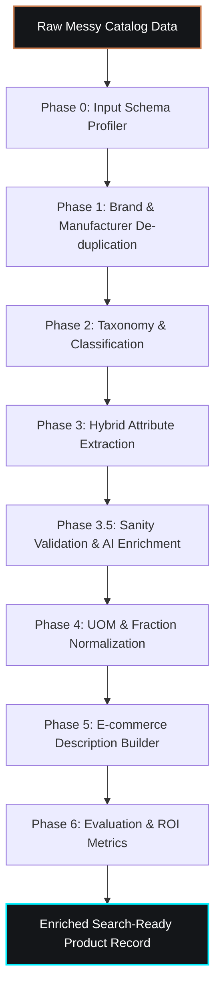
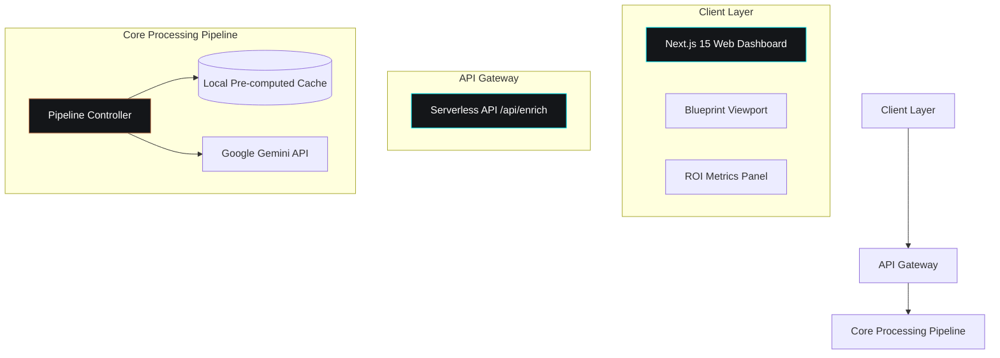

# Tolerance — AI-Powered Product Intelligence

**Tolerance** is an AI-powered data enrichment and catalog engine built for industrial commerce. In engineering, *tolerance* represents the allowable deviation from a specification. This product takes messy, out-of-spec distributor product data and converges it to target content guidelines.

This application is built for the **UniHack** hackathon, solving the challenge of transforming minimal, cryptic catalog records (e.g. `"3/8 CPLG BRS 150#"`) into structured, search-ready, and commerce-ready product listings.

## 🚀 Live Demo & Repository
* **GitHub Repository**: [Saatvik-G/Tolerance](https://github.com/Saatvik-G/Tolerance.git)
* **Live Deployment**: Deployed on Vercel.

---

## 🎯 Outcomes & Features
Tolerance addresses all four core outcomes of the Unilog UniHack challenge:

### 1. Structured Data Generation (Phase 1, 2, 3 & 5)
* **Taxonomy Classification**: Automatically classifies products into a 3-level deep category hierarchy (e.g., `Plumbing > Valves & Fittings > Pipe Fittings`) using Gemini Flash.
* **Hybrid Attribute Extraction**: Parses cryptic text tokens using deterministic regex rules for clear patterns and resolves long-tail terms using LLM prompts.
* **Commerce-Ready Description Builder**: Auto-generates standard short descriptions, invoice descriptions (CAPS, ≤40 characters), mobile descriptions (60-80 characters), and specification lists according to strict content formulas.

### 2. Accuracy & Consistency (Phase 1, 4 & 6)
* **Fuzzy De-duplication**: Reconciles spelling variants of manufacturers and brands (e.g., `"Whirlpool Corp"` $\rightarrow$ `"Whirlpool Corporation"`) using string distance metrics and matches them against canonical listings.
* **UOM & Fraction Cleansing**: Normalizes unit abbreviations (e.g., `inches` to `in`, `volts` to `V`) with strict spacing constraints, and performs decimal-to-fraction conversions (e.g. `0.5 in` to `1/2 in`).

### 3. AI Validation & Enrichment (Phase 3.5)
* **Active Conflict Checking**: Flags logical contradictions (e.g., matching a PVC material with a metal pressure rating of 150 lb) and marks them as warnings or errors.
* **AI-Inferred Enrichment**: Proposes standard specification defaults for missing specs (e.g. default household voltage of 120 V), clearly labeling them as `AI-Inferred` for auditing.
* **Audit Trail & Bounded Inputs**: Surfaces confidence percentages and provenance (`Rule-Based` vs `LLM-Inferred` vs `AI-Inferred`) for every single attribute value.

### 4. Scalable Catalog Engine (Phase 7)
* **Batch Processing & Throughput**: Processes lists of products concurrently, logging average processing times per SKU.
* **Rate-Limit Resilient Architecture**: Includes a high-fidelity local caching fallback for seed datasets, ensuring instantaneous, rate-limit immune demo runs.

---

## 🎨 Visual Identity & UI
Tolerance avoids the standard "ambient glow" AI template and uses an industrial technical drawing theme:
* **Palette**: Charcoal/graphite slate base (`#0d0e10`, `#141619`) with two functional accent colors:
  * **Blueprint Cyan (`#00f0ff`)**: Digital/resolved parameters and clean fields.
  * **Muted Copper (`#c87a4d`)**: Raw catalog data, manufacturer metadata, and physical components.
* **Typography**: Monospace fonts (`JetBrains Mono`) for specifications and data grids, paired with geometric sans-grotesk (`Space Grotesk`) for headers.
* **Signature Motif**: An interactive **Blueprint Transformation View** showing raw product items morphing into structured specification callouts with leader-lines and tolerance confidence intervals.

---

## 🔄 Data Processing Pipeline Flow


---

## 🛠️ Technical Stack
* **Framework**: Next.js 15 (App Router) + TypeScript
* **Styling**: Tailwind CSS v4 (PostCSS)
* **AI Models**: Gemini 2.5 Flash / `gemini-flash-latest` (via `@google/generative-ai`)
* **Host**: Vercel

### System Architecture


---

## 💻 Local Development Setup

### 1. Prerequisites
* Node.js v18+ and npm

### 2. Install Dependencies
```bash
git clone https://github.com/Saatvik-G/Tolerance.git
cd Tolerance
npm install
```

### 3. Configure Environment Variables
Create a `.env.local` file in the root directory:
```env
GEMINI_API_KEY=your_gemini_api_key_here
```

### 4. Run Development Server
```bash
npm run dev
```
Open [http://localhost:3000](http://localhost:3000) in your browser.

### 5. Build for Production
```bash
npm run build
```

---

## 📦 Scale Projections (Business ROI)
Tolerance translates raw catalog improvements directly into business impact:
* **Manual Time Saved**: Assuming a baseline of 5 minutes per SKU for a human cataloger to research, categorize, extract, and write descriptions:
  * **15 SKUs (Demo)**: Saves **1.3 hours**.
  * **10,000 SKUs**: Saves **833 hours** of manual labor.
  * **50,000 SKUs**: Saves **4,166 hours** (~520 analyst workdays).
* **Indexability Gains**: Cryptic distributor listings that are completely un-indexable are transformed into 100% search-ready, SEO-optimized descriptions.
